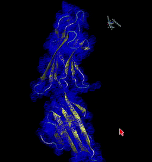

# Robosample: Generalized Coordinates Molecular Simulation Coupled with Gibbs Sampling (GCHMC)

Robosample is a C++ library based on Simbody and Molmodel, which uses high-speed robotics algorithms imlemented in Simbody and molecular modelling facilities in Molmodel to generate Markov Chain Monte Carlo moves coupled with Gibbs sampling able to reproduce the atomistic level detailed distribution of molecular systems.



[More about the method.](https://pubmed.ncbi.nlm.nih.gov/28892630/)

## Prerequisites

* Turn off all `conda` environments.
* Disable all antivirus programs (especially for WSL).
* Execute all commands in the native terminal if running under WSL.
* Install everything in `/home/<username>/` if running under WSL.

## Installing dependencies

Install the dependencies:

```bash
sudo apt-get update
sudo apt-get install git cmake graphviz gfortran libglfw3-dev freeglut3-dev libglew-dev libxmu-dev libeigen3-dev doxygen subversion libblas-dev liblapack-dev libboost-all-dev swig ocl-icd-opencl-dev fftw2 libxmu-dev libxi-dev clang ninja-build linux-tools-common linux-tools-generic linux-tools-`uname -r`
```

### Exports

```bash
export CUDA_INC_DIR=/usr/local/cuda
export CUDA_ROOT=/usr/local/cuda
```

## Cloning the project

```bash
git clone --recurse-submodules https://github.com/spirilaurentiu/Robosample.git
cd Robosample
```

For a specific branch:

```bash
git clone -b build --single-branch https://github.com/spirilaurentiu/Robosample.git
cd Robosample
rm openmm -rf && git clone -b master https://github.com/spirilaurentiu/openmm.git
rm Simbody01 -rf && git clone -b master --single-branch https://github.com/spirilaurentiu/Simbody01.git
rm Molmodel -rf && git clone -b merge --single-branch https://github.com/spirilaurentiu/Molmodel.git
```

For the development branch:

```bash
cd openmm
git checkout master
cd ../Molmodel
git checkout merge
cd ../Simbody01
git checkout master
cd ../
git checkout build
```

If `Simbody01` is missing:

```bash
cd Simbody01/
git submodule update --init
git checkout master
cd ../openmm
git checkout master
cd ../Molmodel
git checkout merge
cd ../
```

## Building Robosample

### Compiler

We have compiled Robosample with `gcc` and `clang`:

* `clang` compiles faster and produces marginally faster code.
* `GCC 11` produces ICE (internal compiler error) for OpenMM when using IPO. This is not the case with earlier versions (`GCC 7.5` works).

### OpenMM platform

OpenMM can use hardware acceleration. Robosample defaults with OpenCL. To set the platform, you can set it via the `cmake` command in the next step:

* `OPENMM_PLATFORM=CPU` for CPU.
* `OPENMM_PLATFORM=CUDA` for CUDA.
* `OPENMM_PLATFORM=OPENCL` for OpenCL.

### Compilation

```bash
mkdir build
cd build
```

For `clang`:

```bash
cmake -G Ninja ../ -D CMAKE_BUILD_TYPE=Release -D CMAKE_C_COMPILER=clang -D CMAKE_CXX_COMPILER=clang++ -D OPENMM_PLATFORM=OPENCL
ninja robosample
```

For `gcc`:

```bash
cmake -G Ninja ../ -D CMAKE_BUILD_TYPE=Release -D CMAKE_C_COMPILER=gcc -D CMAKE_CXX_COMPILER=g++ -D OPENMM_PLATFORM=OPENCL
ninja robosample
```

#### Compiling from Visual Studio Code

Select the kit and then compile:

```bash
>CMake: Scan for Kits
>CMake: Select a Kit
>CMake: Select Variant -> Debug
>CMake: Build (F7)
```

## Running Robosample

The executable is compiled in `build/`. Examples are available in the same folder. To see them, type:

```bash
ll inp.*
```

To run any of them, execute:

```bash
./robosample inp.2but
```

## BOLT

We have applied [LLVM-BOLT](https://github.com/llvm/llvm-project/tree/main/bolt) developed by Facebook.

### Installing BOLT

Downlad BOLT and compile it. A docker file is also available.

```bash
git clone https://github.com/llvm/llvm-project.git
mkdir build
cd build
cmake -G Ninja ../llvm-project/llvm -DLLVM_TARGETS_TO_BUILD="X86;AArch64" -DCMAKE_BUILD_TYPE=Release -DLLVM_ENABLE_ASSERTIONS=ON -DLLVM_ENABLE_PROJECTS="bolt"
ninja bolt
```

Add BOLT to `PATH`:

```bash
echo "PATH=$(pwd)/bin:$PATH" >> ~/.bashrc
source ~/.bashrc
```

Allow intrumentation:

```bash
sudo echo "-1" > /proc/sys/kernel/perf_event_paranoid
```

This does not seem to fix the value forever. You will most likely need to change it every time you want to run BOLT.

### Instrumentation

We have discovered that running **only one** simulation round yields the best result. Also, using a larger system seems to be optimal. Perform the necessary changes in the input file and execute:

```bash
perf record -e cycles:u -j any,u -a -o perf.data ./robosample.pgo.use inp.aper
```

Convert the data into something that can be used by BOLT:

```bash
perf2bolt -p perf.data robosample.pgo.use -o perf.fdata
```

Optimize the binary:

```bash
llvm-bolt robosample.pgo.use -o robosample.pgo.use.bolt -data=perf.fdata -reorder-blocks=ext-tsp -reorder-functions=hfsort -split-functions -split-all-cold -split-eh -dyno-stats
```

Compare the binaries:

```bash
time ./robosample inp.ala10
time ./robosample.bolt inp.ala10
```

## PGO (Profile Guided Optimization)

PGO requires us to compile to compile Robosample once, run it a few times and compile it again taking into account the hot code paths.

First compilation:

```bash
cmake -G Ninja ../ -D CMAKE_BUILD_TYPE=PGO_Train -D CMAKE_C_COMPILER=clang -D CMAKE_CXX_COMPILER=clang++ -D OPENMM_PLATFORM=OPENCL
ninja robosample
```

Clear output of previous runs:

```bash
find . -name "*.gcda" -delete
```

Run the examples:

```bash
bash pgo.sh
```

## Development

Robosample is being developed using [Visual Studio Code](https://code.visualstudio.com/) on Windows. To start it, run `code .` in `Robosample`.

## Sanitizers (**mandatory**)

We use address and undefined behaviour sanitizers in our debug builds. To get the correct output, run:

```bash
echo "export ASAN_OPTIONS=detect_odr_violation=0:detect_leaks=0:protect_shadow_gap=0" >> ~/.bashrc
echo "export UBSAN_OPTIONS=print_stacktrace=1" >> ~/.bashrc
source ~/.bashrc
```

Explaination:

* `detect_odr_violation`
* `detect_leaks=0` - OpenMM has some memory leaks. Set `detect_leaks=1` if you want to see memory all leaks.
* `protect_shadow_gap=0` - OpenCL and CUDA (which both use the NVIDIA driver) conflict with ASAN, as stated by [here](https://stackoverflow.com/a/68027496/3740613).
* `print_stacktrace=1`: show which lines trigger the undefined behaviour sanitizer (UBSAN).

## Fun facts

To get the total number of lines in header and source files, execute this from the root directory:

```bash
find . -name '*.h' -o -name '*.cpp' | xargs wc -l
```

To see all exported symbols, use:

```bash
nm -an build/robosample | c++filt
```
