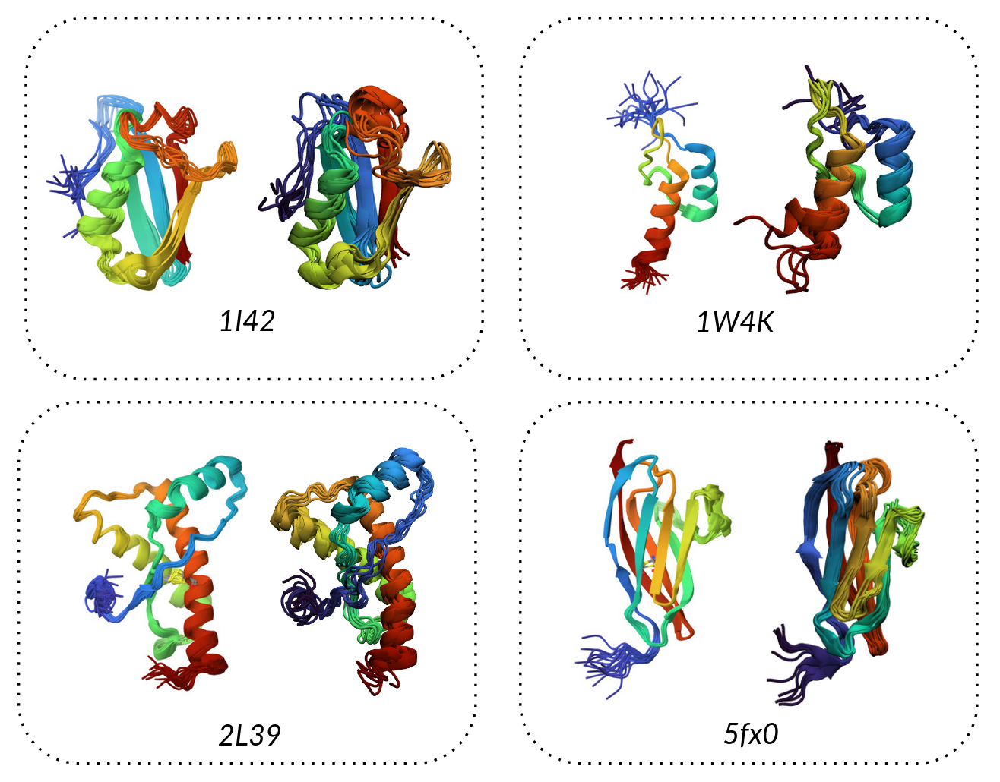

# Robosample: Generalized Coordinates Molecular Simulation Coupled with Gibbs Sampling (GCHMC)

## Code Quality

| Hook | Status |
| :--- | :--- |
| **General** |    |
| **C++** |   |
| **Python** |  [](https://github.com/astral-sh/ruff) |
| **CUDA** |  |
| **Config & Docs** |    |

Robosample uses Simbody and Molmodel to perform efficient GCHMC sampling on macromolecules via reduced-coordinate robotics algorithms, featuring OpenMM GPU support and a dedicated Python/Conda ecosystem for seamless research integration.



## Publications

### Main Publication

If you use **Robosample** in your research, please cite:

> Spiridon, L., Șulea, T. A., Minh, D. D., & Petrescu, A. J. (2020). **Robosample: A rigid-body molecular simulation program based on robot mechanics.** *Biochimica et Biophysica Acta (BBA)-General Subjects*, 1864(8), 129616. [](https://doi.org/10.1016/j.bbagen.2020.129616)

### Related Theory & Applications

The following publications describe the underlying algorithms or demonstrate applications of the software:

* > Spiridon, L., & Minh, D. D. (2017). **Hamiltonian Monte Carlo with constrained molecular dynamics as Gibbs sampling.** *Journal of Chemical Theory and Computation*, 13(10), 4649-4659. [](https://doi.org/10.1021/acs.jctc.7b00570)

## Check hardware acceleration capabilities

On native Linux, output should not be empty:

```bash
lspci | grep -iE "vga|3d"
```

On Windows, open `Device Manager` and read the GPUs from `Display adapters`. Also, check WSL version (should be 2) in `Powershell`:

```bash
wsl --version
```

## CUDA

### Native Linux

Check that the driver (if already installed) works correctly:

* Userspace tool works, driver communicates with kernel and GPU is accessible: `nvidia-smi` should output a table showing your GPU name (e.g., RTX 4090) and `Driver Version: 5xx.xx`.

* Userspace tool exists: `command -v nvidia-smi` should point to `/usr/bin/nvidia-smi`. If empty, there is a `$PATH` or package issue.

* Confirm kernel module is active: `cat /proc/driver/nvidia/version` and, if `nvidia-smi` works, matches `nvidia-smi --query-gpu=driver_version --format=csv,noheader`.

* Kernel module is loaded: `lsmod | grep nvidia` which should output `nvidia, nvidia_drm, nvidia_modeset, nvidia_uvm`. If empty, the driver is not loaded.

* Verify module actually exists: `modinfo nvidia | grep filename` and can be inserted manually: `sudo modprobe nvidia`.

* `nouveau`, an open-source reverse-engineered Linux graphics driver for NVIDIA cards, is fully disabled. The following commands should return nothing: `lsmod | grep nouveau`, `cat /etc/modprobe.d/* | grep nouveau` and `lsinitramfs /boot/initrd.img-$(uname -r) | grep nouveau`.

* Kernel module loads successfully: `dmesg | grep -i nvidia`.

* Driver installed for current kernel: `uname -r` and `dkms status | grep nvidia` should match.

* Driver bound to GPU: `lspci -k | grep -A 3 -i nvidia` which should output `Kernel driver in use: nvidia`. If it says `nouveau`, the wrong driver bound to this GPU.

* Secure Boot is disabled: `mokutil --sb-state`. The DKMS-built nvidia.ko module may be blocked from loading unless it is signed and enrolled via MOK. This is one of the most common post-installation failure modes on UEFI systems.

* Driver is actually visible: `lspci | grep -i nvidia`.

Please note that `nvcc` is part of CUDA toolkit, not Nvidia driver, so we do not test for it here.

If any of these tests fail, it means that the driver is incorrectly installed. We begin by checking what drivers we currently have installed: `dpkg -l | grep -i nvidia`.

Remove the old driver:

```bash
sudo apt purge "*nvidia*"
sudo apt autoremove
```

Confirm that we uninstalled everything:

* `lsmod | grep nvidia` should be empty.

* `lspci -k | grep -A3 -i nvidia` should show `nouveau`.

Drivers can be downloaded either manually from the Nnvidia website or automatically by Ubuntu. However, manual downloads don't support DKMS (Dynamic Kernel Module Support), meaning that kernel updates can potentially break the driver installation. `ubuntu-drivers` is safer because it considers Ubuntu version GLIBC and kernel stability, whereas the website just looks at the GPU model. `ubuntu-drivers` uses DKMS, meaning that the driver automatically rebuilds itself when the kernel updates. Note that both methods respect the compatibility matrix.

First, check what the recommended version is for your machine: `sudo ubuntu-drivers devices`.

Install the recommended one (`nvidia-smi` will not work before you `sudo reboot`):

```bash
sudo ubuntu-drivers autoinstall
sudo reboot
```

After reboot, check for module load errors: `dmesg | grep -i nvidia`.

Check if the driver communicates with kernel and GPU is accessible: `nvidia-smi`.

The `CUDA Version` in the `nvidia-smi` is the maximum CUDA runtime API version supported by the driver. The driver does not install any CUDA toolkit.

### WSL2

In `Powershell`, confirm that `nvidia-smi` works: `nvidia-smi`.

If not already done, download and install [normal Windows driver (Game Ready or Studio)](https://www.nvidia.com/Download/index.aspx). **Do not install Linux drivers**. After installation, **reboot Windows**.

Open Linux and check that:

* Windows driver is exposed to WSL: `nvidia-smi` should work and `command -v nvidia-smi` should point to Windows Nvidia driver reflection `/usr/lib/wsl/lib/nvidia-smi`.

* Linux Nvidia driver is not installed: `dpkg -l | grep nvidia` should be empty.

* Confirm kernel module is not activate: `/proc/driver/nvidia/version` and `dkms status | grep nvidia` should be empty.

* No kernel module attempts exist: `lsmod | grep nvidia` should be empty.

* GPU bridge device exists: `ls -l /dev/dxg`.

If any of these tests fail, it means that the driver is incorrectly installed. We begin by checking what drivers we currently have installed: `dpkg -l | grep -i nvidia`.

Remove the old driver:

```bash
sudo apt purge "*nvidia*"
sudo apt autoremove
```

Shutdown WSL from `Powershell` and restart (WSL does not have a real reboot). Upon restart, WSL will re-link the `/usr/lib/wsl/lib` directory from the Windows host: `wsl --shutdown`.

## OpenCL

OpenCL installation depends on the udnerlying hardware:

* Nvidia GPU: already installed with the divers.

* AMD GPU: `TODO`

* Intel GPU/CPU: install `sudo apt-get install intel-opencl-icd`

* AMD CPU: `TODO`

Other dependencies will be installed via `conda` (see below).

---

### Install `mamba`

We use [`mamba`](https://github.com/mamba-org/mamba) for fast and reliable environment management. Choose the option that matches your current setup.

#### Option A — Fresh install (recommended)

If you **do not already use `conda`**, install **miniforge** (comes with `mamba` preinstalled):

```bash
cd ~
wget "https://github.com/conda-forge/miniforge/releases/latest/download/Miniforge3-$(uname)-$(uname -m).sh"
bash Miniforge3-$(uname)-$(uname -m).sh
source ~/.bashrc
```

Get current `conda` version: `conda --version`.

Get the latest version: `conda search conda -c defaults | tail`.

Update to the latest version: `conda install conda=26.1.1`.

#### Option B — Existing `miniconda` / `anaconda`

Starting with version `23.10`, the default solver is `conda-libmamba-solver`, a plugin which uses `libmamba`, the same `libsolv`-powered solver used by `mamba`:

Get current `conda` version: `conda --version`.

Get the latest version: `conda search conda -c defaults | tail`.

Update to the latest version: `conda install conda=26.1.1`.

Now, the solver should be `libmamba`: `conda config --show solver`.

Now we install `mamba`: `conda install -n base -c conda-forge mamba`.

#### Install base `pip` packages

```bash
pip install --upgrade pip
pip install conda-merge zstandard
```

## Other prerequisites

```bash
sudo apt update
sudo apt install ruby-github-linguist clang-tidy clang-tools
```

## Installing Robosample

### Clone Robosample

```bash
git clone --recurse-submodules https://github.com/spirilaurentiu/Robosample.git
cd Robosample
git checkout refactor
bash tools/dev-sync.sh
bash tools/setup-dev.sh
```

Finally, perform a local install of the package. This doesn't install anything, it just creates an editable between the virtual environment and the source code, so changes are reflected immediately:

```bash
pip install -e .
```

### Updating OpenMM from upstream

We have a special branch named `update` which holds the original OpenMM code:

```bash
cd openm/
git checkout update
git remote add upstream https://github.com/openmm/openmm.git
git fetch upstream
git reset --hard upstream/master
git clean -fd
git push origin update --force
```

### Create a `mamba` environment

While all environments install Python 3.12, CUDA introduces multiple version dependencies:

| CUDA  | OpenMM | PyTorch |
|-------|--------|---------|
| 12.0  | 8.1.2  | 2.5.1   |
| 12.1  | 8.1.2  | 2.5.1   |
| 12.2  | 8.1.2  | 2.5.1   |
| 12.3  | 8.1.2  | 2.5.1   |
| 12.4  | 8.1.2  | 2.5.1   |
| 12.5  | 8.1.2  | 2.5.1   |
| 12.6  | 8.3.1  | 2.7.1   |
| 12.8  | 8.3.1  | 2.7.1   |
| 12.9  | 8.3.1  | 2.7.1   |
| 13.0  | 8.5.1  | 2.11.0  |
| 13.1  | 8.5.1  | 2.11.0  |
| 13.2  | 8.5.1  | 2.11.0  |
| 13.3  | 8.5.1  | 2.11.0  |

`cuBLAS` and `cuDNN` are requested and installed by PyTorch.

The development environment is a combination of `.yaml` files from `envs/`:

* `envs/base.yaml` (bioinformatics tools).

* `envs/cuda*.yaml` for NVidia GPUs.

* `envs/cpu.yaml` for no hardware acceleration.

Combine these files into a `.yaml` that contains all tools needed to configure and build the project and install (**hardware acceleration `.yaml` must be last**):

```bash
conda-merge envs/base.yaml envs/cuda13.0.yaml > robo_cuda13.0.yaml
mamba env create -f robo_cuda13.0.yaml
conda activate robo_cuda13.0
```

Set `modeller` key in:

```bash
file $CONDA_PREFIX/lib/modeller-*/modlib/modeller/config.py
```

If using CUDA, set up variables:

```bash
conda activate robo_cuda13.0

mkdir -p $CONDA_PREFIX/etc/conda/activate.d
cat > $CONDA_PREFIX/etc/conda/activate.d/env_vars.sh << 'EOF'
export OPENMM_CUDA_COMPILER="$CONDA_PREFIX/bin/nvcc"
export CUDA_HOST_COMPILER="$CONDA_PREFIX/bin/x86_64-conda-linux-gnu-g++"
export OMPI_MCA_opal_cuda_support=true
export UCX_MEMTYPE_CACHE=n
EOF

mkdir -p $CONDA_PREFIX/etc/conda/deactivate.d
cat > $CONDA_PREFIX/etc/conda/deactivate.d/env_vars.sh << 'EOF'
unset OPENMM_CUDA_COMPILER
unset CUDA_HOST_COMPILER
unset OMPI_MCA_opal_cuda_support
unset UCX_MEMTYPE_CACHE
EOF

conda activate base && conda activate robo_cuda13.0
```

Test the environment (CUDA):

```bash
bash envs/test.sh
```

If something goes wrong, delete this environment using:

```bash
conda deactivate
mamba env remove -n robo_cuda13.0
```

### Building Robosample

#### Full optimization

We have a custom `nox` configuration that does uses Program Guided Optimization (PGO), `perf` and `LLVM-BOLT` to build a fully optimized binary inside `python/robosample`:

```bash
sudo sysctl -w kernel.perf_event_paranoid=-1
nox -s build_optimized
```

#### Custom builds

If using CUDA, the default architecture is `native` which is not portable. If you build for distribution, go to `CMakePresets.json` and replace `CMAKE_CUDA_ARCHITECTURES` to `70;75;80;86` (Volta, Turing, Ampere (DC) and Ampere (Consumer)).

The build system is organized into a matrix of Platforms and Build Types. You can combine them using the format `--preset <platform>-<type>`.

Platforms: `cpu`, `opencl`, `cuda`, `reference`.

Build types: `debug`, `release`, `relwithdebinfo`, `pgo-train`, `pgo-use`.

While in `robosample/`:

```bash
conda activate robo_XXX
cmake --preset cuda-release
cmake --build --preset cuda-release
```

### Test installation

```bash
python -m robosample.test_installation
```

### Visual Studio Code support

The development `conda` environment must be activate when starting Visual Studio Code:

```bash
conda activate robo_XXX
code Robosample/
```

The repository comes with a nubmer of pre-configured settings:

* Extensions: Open the extensions tab and type `@recommended`. We recommend using `CodeLLDB` for a better debugging experience and `clangd` for faster code completion (notice that it requries a language server to be installed, so follow their project description).

* Build configurations: type `Left-Ctrl + Shift + P` and run `CMake: Select Configure Preset` and `CMake: Select Build Preset`, then press `F7`. Files will be automatically installed in `python/robosample/`.

* Run configurations for `Python` and `C++` debugging.

To select a build type, press `Ctrl + Shift + P`, then `CMake: Select configure preset` and compile using `F7`.

To run, select a configuration. We allow for both Python and C++ debugging.

To run tests, press `Ctrl + Shift + P`, then `Tasks: Run tasks` and then `Run tests and coverage` which will run `nox` (see below).

Git pushes to `remote` are guarded by these tests and you cannot push unless all tests pass. However, test results can be ignored via `git commit -no-verify`.

### Testing via CLI

Although most of Robosample is written in C++, testing is done via the Python interface (`tests/`):

```bash
nox -s tests
```

Coverage is available for the Python and the C++ library (only for `Debug` or `RelWithDebInfo`). This command will also create the code coverage badge.

### Running the program via CLI

We provide a series of examples in `robosample/examples`. To rung the program:

```bash
mkdir simulation/
cd simulation/
python3 ../python/robosample/roborun.py ala-dipeptide ../examples/ala-dipeptide.prmtop ../examples/ala-dipeptide.rst7 6000 0 1 1
```

### GitHub Linguist

Too see coding language stats, run:

```bash
github-linguist --breakdown | head
```
