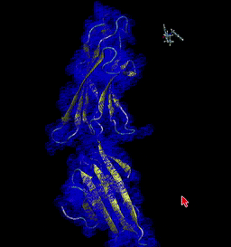

# Robosample: Generalized Coordinates Molecular Simulation Coupled with Gibbs Sampling (GCHMC)

Robosample is a C++ library based on Simbody and Molmodel, which uses high-speed robotics algorithms imlemented in Simbody and molecular modelling facilities in Molmodel to generate Markov Chain Monte Carlo moves coupled with Gibbs sampling able to reproduce the atomistic level detailed distribution of molecular systems.



[More about the method.](https://pubmed.ncbi.nlm.nih.gov/28892630/)

## Prerequisites

* Turn off all `conda` environments.
* Disable all antivirus programs (known to be needed for WSL).
* Execute all commands in the native terminal if running under WSL (not in VS Code or any other application that provides a terminal).

## Installing dependencies

### Installing the Nvidia driver
The only working driver is `proprietary`, not `open`. Remove the `open` driver and all CUDA Toolkit installations:
```bash
sudo apt --fix-broken install
sudo apt-get purge 'nvidia-*' 'cuda*'
sudo apt-get autoremove
sudo rm -rf /usr/local/cuda*
```

First, check what the recommended version is for your machine. To my knowledge, the last supported kernel is 6.14 (check with `uname -r`).
```
ubuntu-drivers devices
```

Install the recommended one (`nvidia-smi` will not work before you `sudo reboot`):
```
sudo apt install nvidia-driver-580
sudo reboot
```

### Installing CUDA Toolkit 12.8
Only this exact version can be used and is hard-coded inside the build files. It is forward compatible with any future CUDA toolkit versions. Download and follow instructions from [here](https://developer.nvidia.com/cuda-12-8-0-download-archive):
```bash
wget https://developer.download.nvidia.com/compute/cuda/repos/ubuntu2404/x86_64/cuda-keyring_1.1-1_all.deb
sudo dpkg -i cuda-keyring_1.1-1_all.deb
sudo apt-get update
sudo apt-get -y install cuda-toolkit-12-8
```

At this point, you should have working `nvidia-smi`. However, `nvcc` is not available at the terminal since nothing from the CUDA Toolkit is in `$PATH`.
It can still be accessed via the absolute path: `/usr/local/cuda/bin/nvcc --version`.
This is no problem since Robosample references absolute pathways to this installation.

### Installing OpenGL (visualizer) and OpenCL (hardware acceleration)
Straightforward installation that does not interfere with CUDA:
```bash
sudo update
sudo apt-get install libglfw3-dev freeglut3-dev libglew-dev libxmu-dev libxmu-dev libxi-dev ocl-icd-opencl-dev
```

### Miniconda
Download and install from their [official website](https://www.anaconda.com/download) and install using:
```bash
wget https://repo.anaconda.com/miniconda/Miniconda3-latest-Linux-x86_64.sh
chmod +x Miniconda3-latest-Linux-x86_64.sh
bash ./Miniconda3-latest-Linux-x86_64.sh
```

Install the minimum packages:
```bash
conda install mamba conda-build -c conda-forge
```

### Other dependencies
Install the dependencies:
```bash
sudo apt-get update
sudo apt-get install git cmake graphviz gfortran libeigen3-dev doxygen subversion libblas-dev liblapack-dev libboost-all-dev swig fftw2 clang ninja-build
```

### CMake

Minimum `CMake` version is 3.17. It can be tested with:

```bash
cmake --version
```

To install the correct version, head to the [CMake website](https://cmake.org/download/) and find the `.tar.gz` version for your operating system. The code below is an example for CMake 3.27 under Linux:

```bash
cd ~
wget https://github.com/Kitware/CMake/releases/download/v3.27.7/cmake-3.27.7-linux-x86_64.tar.gz
tar -xf cmake-3.27.7-linux-x86_64.tar.gz
rm cmake-3.27.7-linux-x86_64.tar.gz
```

The executable is located in the `bin` folder:

```bash
~/cmake-3.27.7-linux-x86_64/cmake-3.27.7-linux-x86_64/bin/cmake
```

### Ninja

There is no required Ninja version. It can also be replaced with Unix Makefiles. If installation from `apt-get` fails, downloading the binaries is recommended. Go to [Ninja website](https://ninja-build.org/) and find the [binary downloads](https://ninja-build.org/). The following is an example for version 1.11.1:

```bash
cd ~
wget https://github.com/ninja-build/ninja/releases/download/v1.11.1/ninja-linux.zip
unzip ninja-linux.zip
rm ninja-linux.zip
```

If used as intended further into the README, the executable must be run from the full path:

```bash
/home/myuser/ninja
```

## Cloning the project

```bash
git clone --recurse-submodules https://github.com/spirilaurentiu/Robosample.git
cd Robosample

cd openmm
git checkout master
cd ../Molmodel
git checkout master
cd ../Simbody01
git checkout master
cd ../
git checkout master
```

For a specific branch (named `build` in this example):

```bash
git clone -b build --single-branch https://github.com/spirilaurentiu/Robosample.git
cd Robosample
rm openmm -rf && git clone -b master https://github.com/spirilaurentiu/openmm.git
rm Simbody01 -rf && git clone -b master --single-branch https://github.com/spirilaurentiu/Simbody01.git
rm Molmodel -rf && git clone -b merge --single-branch https://github.com/spirilaurentiu/Molmodel.git
```

## Building Robosample

### Compiler

We have compiled Robosample with `gcc` and `clang`:

* `clang` compiles faster and produces marginally faster code.
* `GCC 11` produces ICE (internal compiler error) for OpenMM when using IPO. This is not the case with earlier versions (`GCC 7.5` works).

### OpenMM platform

OpenMM can use hardware acceleration. Robosample defaults with OpenCL. To set the platform, you can set it via the `cmake` command in the next step:

* `OPENMM_PLATFORM=CPU` for CPU.
* `OPENMM_PLATFORM=CUDA` for CUDA.
* `OPENMM_PLATFORM=OPENCL` for OpenCL.

### Compilation

```bash
mkdir build
cd build
```

For `clang`:

```bash
cmake -G Ninja ../ -D CMAKE_BUILD_TYPE=Release -D CMAKE_C_COMPILER=clang -D CMAKE_CXX_COMPILER=clang++ -D OPENMM_PLATFORM=OPENCL
ninja robosample
```

For `gcc`:

```bash
cmake -G Ninja ../ -D CMAKE_BUILD_TYPE=Release -D CMAKE_C_COMPILER=gcc -D CMAKE_CXX_COMPILER=g++ -D OPENMM_PLATFORM=OPENCL
ninja robosample
```

Assuming that CMake and Ninja have been installed as binaries and not from `apt-get`:

```bash
~/cmake-3.27.7-linux-x86_64/bin/cmake -G Ninja -DCMAKE_MAKE_PROGRAM=/home/myuser/ninja -D CMAKE_BUILD_TYPE=Release -D CMAKE_C_COMPILER=gcc -D CMAKE_CXX_COMPILER=g++ -D OPENMM_PLATFORM=OPENCL
```

Once the CMake files have been generated, Robosample can be compiled with Ninja:

```bash
~/ninja robosample
```

If you want to use Unix Makefiles:

```bash
cmake -G "Unix Makefiles" ../ -D CMAKE_BUILD_TYPE=Release -D CMAKE_C_COMPILER=clang -D CMAKE_CXX_COMPILER=clang++ -D OPENMM_PLATFORM=OPENCL
make -j$(nproc)
```

#### Compiling from Visual Studio Code

Select the kit and then compile:

```bash
>CMake: Scan for Kits
>CMake: Select a Kit
>CMake: Select Variant -> Debug
>CMake: Build (F7)
```

## Running from the Python interface

```bash
conda install -c conda-forge mamba
mamba env create -f tools/robo.yaml
```

In order to run the program under VSCode debugger, place breakpoints in `simulate.py` and run with `Python: Current File (Debug Robosample Libraries)`. After it stops, run start `(gdb) Attach to Python`, enter the PID of the `python` instance (usually, it has `-X frozen_modules=OFF` as arguments) and press the `Continue (F5)` button of the VSCode debugger. Look in the `CALL STACK` section on the left side of the screen and press `(gdb) Attach to Python` and it should take you to the breakpoint placed inside a `.cpp` file. For more details, see [this](https://nadiah.org/2020/03/01/example-debug-mixed-python-c-in-visual-studio-code/).

## BOLT

We have applied [LLVM-BOLT](https://github.com/llvm/llvm-project/tree/main/bolt) developed by Facebook.

### Installing prerequisites

```bash
sudo apt-get update
sudo apt-get install linux-tools-common linux-tools-generic linux-tools-`uname -r`
```

### Installing BOLT

Downlad BOLT and compile it. A docker file is also available.

```bash
git clone https://github.com/llvm/llvm-project.git
cd llvm-project
mkdir build
cd build
cmake -G Ninja ../llvm -DLLVM_TARGETS_TO_BUILD="X86;AArch64" -DCMAKE_BUILD_TYPE=Release -DLLVM_ENABLE_ASSERTIONS=ON -DLLVM_ENABLE_PROJECTS="bolt"
ninja bolt
```

Add BOLT to `PATH`:

```bash
echo "PATH=$(pwd)/bin:$PATH" >> ~/.bashrc
source ~/.bashrc
```

Allow intrumentation:

```bash
sudo sysctl kernel.perf_event_paranoid=-1
```

### Instrumentation

We have discovered that running **only one** simulation round yields the best result. Also, using a larger system seems to be optimal. Perform the necessary changes in the input file and execute:

```bash
perf record -e cycles:u -j any,u -a -o perf.data ./robosample.pgo.use inp.aper
```

Convert the data into something that can be used by BOLT:

```bash
perf2bolt -p perf.data robosample.pgo.use -o perf.fdata
```

Optimize the binary:

```bash
llvm-bolt robosample.pgo.use -o robosample.pgo.use.bolt -data=perf.fdata -reorder-blocks=ext-tsp -reorder-functions=hfsort -split-functions -split-all-cold -split-eh -dyno-stats
```

Compare the binaries:

```bash
time ./robosample inp.ala10
time ./robosample.bolt inp.ala10
```

## PGO (Profile Guided Optimization)

PGO requires us to compile to compile Robosample once, run it a few times and compile it again taking into account the hot code paths.

First compilation:

```bash
cmake -G Ninja ../ -D CMAKE_BUILD_TYPE=PGO_Train -D CMAKE_C_COMPILER=clang -D CMAKE_CXX_COMPILER=clang++ -D OPENMM_PLATFORM=OPENCL
ninja robosample
```

Clear output of previous runs:

```bash
find . -name "*.gcda" -delete
```

Run the examples:

```bash
bash pgo.sh
```

## Development

Robosample is being developed using [Visual Studio Code](https://code.visualstudio.com/) on Windows. To start it, run `code .` in `Robosample`.

## Sanitizers (**mandatory**)

We use address and undefined behaviour sanitizers in our debug builds. To get the correct output, run:

```bash
echo "export ASAN_OPTIONS=detect_odr_violation=0:detect_leaks=0:protect_shadow_gap=0" >> ~/.bashrc
echo "export UBSAN_OPTIONS=print_stacktrace=1" >> ~/.bashrc
source ~/.bashrc
```

Explaination:

* `detect_odr_violation`
* `detect_leaks=0` - OpenMM has some memory leaks. Set `detect_leaks=1` if you want to see memory all leaks.
* `protect_shadow_gap=0` - OpenCL and CUDA (which both use the NVIDIA driver) conflict with ASAN, as stated by [here](https://stackoverflow.com/a/68027496/3740613).
* `print_stacktrace=1`: show which lines trigger the undefined behaviour sanitizer (UBSAN).

## Fun facts

To get the total number of lines in header and source files, execute this from the root directory:

```bash
find . -name '*.h' -o -name '*.cpp' | xargs wc -l
```

To see all exported symbols, use:

```bash
nm -an build/robosample | c++filt
```
 

bash
```
cmake -G Ninja ../ -D CMAKE_BUILD_TYPE=PGO_Train -D CMAKE_C_COMPILER=clang -D CMAKE_CXX_COMPILER=clang++ -D OPENMM_PLATFORM=OPENCL
ninja robosample
```


# Cleanup
```
sudo apt purge 'nvidia-*'
sudo apt autoremove --purge

sudo rm -rf /usr/local/cuda*
sudo rm -rf /usr/lib/nvidia
sudo rm -rf /usr/lib/x86_64-linux-gnu/libcuda.so*
sudo rm -rf /usr/lib/x86_64-linux-gnu/libnvidia-*

sudo reboot
```

# Reboot
```

```


# Nvidia Driver - this queries Linux about the install GPU and installs the recommended driver.
```
sudo apt update
sudo ubuntu-drivers autoinstall
```


# Reboot
```
sudo reboot
```


# Machine set-up for developers


